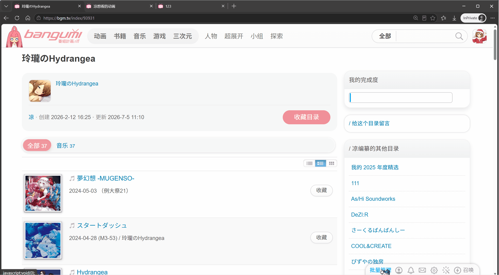
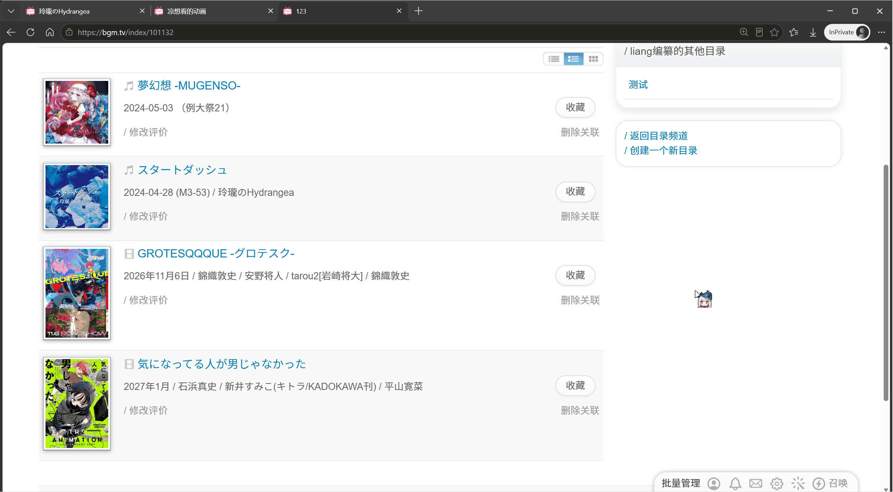
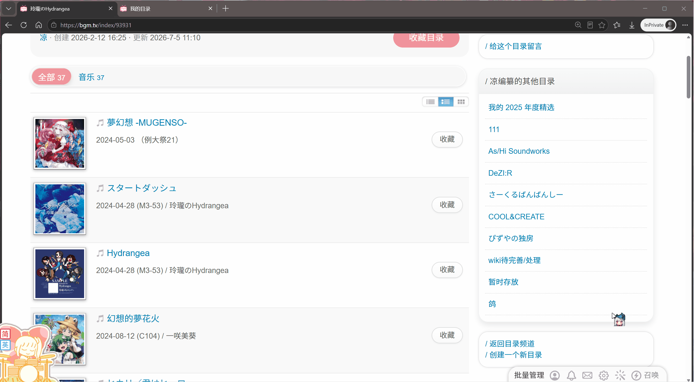

# 安装

)

## 简介
在目录内/收藏页面右下角"用户名"左边添加“批量操作”按钮

可将页面内条目的收藏状态改变（wish / collect / do / on_hold / dropped 以及从收藏中删除）
在自己的目录中，还可以选择从目录中删除。在其他人的目录，可以选择从条目添加到自己的目录（输入目录id / 选择建立目录）

在用户左边添加一个“批量操作”

在目录内：

在收藏页面（除概览）：

选中条目后点击“加入目录”可以选择修改收藏状态或者是创建目录并加入
     

面板右下角可拖动缩放

### 演示：
从目录和收藏页添加

修改收藏状态和从目录中删除

创建目录并加入条目

